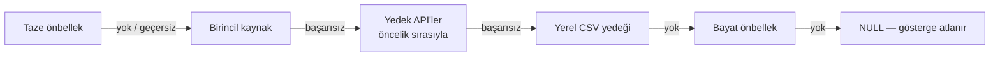

   

Türkiye ekonomisine ilişkin açık kaynaklı verilerle çalışan, kayan pencere (rolling window) yaklaşımıyla güncellenen Otoregresif (AR) modelleri En Küçük Kareler (EKK) yöntemiyle tahmin eden ve sonuçları interaktif bir web arayüzü üzerinden sunan uçtan uca bir ekonomik tahmin sistemidir.

Bu proje, Atılım Üniversitesi bünyesinde TÜBİTAK 2209-A Üniversite Öğrencileri Araştırma Projeleri Destekleme Programı kapsamında geliştirilmiştir.

---

## İçindekiler

1. [Genel Bakış](https://claude.ai/chat/f93c0a81-2856-4528-a1df-f48764e14ae6#1-genel-bak%C4%B1%C5%9F)
2. [Metodoloji](https://claude.ai/chat/f93c0a81-2856-4528-a1df-f48764e14ae6#2-metodoloji)
3. [Sistem Mimarisi](https://claude.ai/chat/f93c0a81-2856-4528-a1df-f48764e14ae6#3-sistem-mimarisi)
4. [Dizin Yapısı](https://claude.ai/chat/f93c0a81-2856-4528-a1df-f48764e14ae6#4-dizin-yap%C4%B1s%C4%B1)
5. [Kurulum](https://claude.ai/chat/f93c0a81-2856-4528-a1df-f48764e14ae6#5-kurulum)
6. [Kullanım](https://claude.ai/chat/f93c0a81-2856-4528-a1df-f48764e14ae6#6-kullan%C4%B1m)
7. [Yapılandırma](https://claude.ai/chat/f93c0a81-2856-4528-a1df-f48764e14ae6#7-yap%C4%B1land%C4%B1rma)
8. [Modül Referansı](https://claude.ai/chat/f93c0a81-2856-4528-a1df-f48764e14ae6#8-mod%C3%BCl-referans%C4%B1)
9. [Genişletilebilirlik](https://claude.ai/chat/f93c0a81-2856-4528-a1df-f48764e14ae6#9-geni%C5%9Fletilebilirlik)
10. [Tasarım İlkeleri](https://claude.ai/chat/f93c0a81-2856-4528-a1df-f48764e14ae6#10-tasar%C4%B1m-i%CC%87lkeleri)
11. [Kaynakça](https://claude.ai/chat/f93c0a81-2856-4528-a1df-f48764e14ae6#11-kaynak%C3%A7a)

---

## 1. Genel Bakış

Ekonomik göstergelerdeki yüksek volatilite, güncellenebilir ve güvenilir tahmin araçlarına duyulan ihtiyacı artırmaktadır. Sabit parametreli klasik zaman serisi modelleri, yapısal kırılmalar karşısında genellikle yetersiz performans göstermektedir.

Bu sistem, söz konusu kısıtı gidermek amacıyla AR-EKK modellerini sabit bir kalıba sığdırmak yerine **kayan pencere** yaklaşımıyla her dönem yeniden tahmin eder. Gecikme derecesi ve pencere uzunluğu her gösterge için **çapraz doğrulama** ile seçilir; böylece model, değişen ekonomik koşullara sürekli uyum sağlar.

### Temel İşlevler

- Beş açık kaynaktan (TCMB EVDS, FRED, Dünya Bankası, OECD, Yahoo Finance / BIST) otomatik veri toplama
- Her gösterge için **çok kanallı yedekleme zinciri**: birincil kaynak → yedek API'ler → yerel CSV yedeği → bayat önbellek
- Her serinin **kendi frekansında** (aylık, çeyreklik, yıllık) kesintisiz bir takvime oturtulması ve ara boşlukların doğrusal enterpolasyonla doldurulması
- Gösterge bazında veri kalitesi raporu
- Kayan pencereyle her dönem yeniden tahmin edilen AR-EKK modelleri; gecikme (p) ve pencere (w) için çapraz doğrulamalı model seçimi
- Örnek dışı (out-of-sample) performansın MAE, MSE, RMSE, MAPE, Theil U ve naif modele göre göreli RMSE ile ölçülmesi
- Çok adımlı ileriye dönük tahmin
- Her verinin hangi kaynaktan, hangi kodla ve hangi durumda (API / önbellek / yedek) geldiğini kaydeden metaveri tablosu
- Sonuçların Shiny tabanlı interaktif bir arayüzde sunulması

### Araştırma Sorusu

Açık kaynaklı veri tabanlarından API aracılığıyla elde edilen Türkiye ekonomik göstergeleri, kayan pencere yöntemiyle güncellenen AR-EKK modelleri kullanılarak anlamlı doğrulukla tahmin edilebilir mi?

### Kapsanan Göstergeler

Sistemde 21 aktif gösterge tanımlıdır ve her biri bir **role** atanmıştır. Tablodaki p / w değerleri başlangıç (varsayılan) değerleridir; çapraz doğrulama açıkken nihai değerler veriye göre seçilir.

**Bağımlı değişkenler**

|Anahtar|Gösterge|Frekans|Birincil kaynak · kod|p / w|Kaynak önceliği|
|---|---|---|---|---|---|
|`ENFLASYON`|Enflasyon Oranı (TÜFE, yıllık %)|Aylık|EVDS · `TP_TUKFIY2025_GENEL`|12 / 42|EVDS → FRED → Dünya Bankası → OECD → CSV|
|`BUYUME`|Ekonomik Büyüme (reel GSYH, yıllık %)|Çeyreklik|EVDS · `TP_GSYIH20_BY_B1GQ`|8 / 18|EVDS → FRED → Dünya Bankası → CSV|
|`ISSIZLIK`|İşsizlik Oranı|Aylık|EVDS · `TP_YISGUCU2_G8`|5 / 48|EVDS → FRED → Dünya Bankası → CSV|
|`USDTRY`|Döviz Kuru (USD/TRY)|Aylık|EVDS · `TP_DK_USD_A_YTL`|11 / 60|EVDS → Dünya Bankası → OECD → CSV|
|`EURTRY`|Döviz Kuru (EUR/TRY)|Aylık|EVDS · `TP_DK_EUR_A_YTL`|3 / 36|EVDS → CSV|
|`BIST100`|Borsa Endeksi (BIST-100)|Aylık|Yahoo Finance · `XU100.IS`|3 / 48*|BIST → CSV|

**Kontrol değişkenleri**

|Anahtar|Gösterge|Frekans|Birincil kaynak · kod|p / w|Kaynak önceliği|
|---|---|---|---|---|---|
|`FAIZ`|TCMB Politika Faizi|Aylık|EVDS · `TP_BISPOLFAIZ_TUR`|4 / 54|EVDS → FRED (yaklaşık seri) → CSV|
|`DIS_TICARET`|Dış Ticaret Dengesi|Aylık|EVDS · `TP_ODEAYRSUNUM6_Q4`|12 / 60|EVDS → FRED → CSV|
|`SANAYI_URETIM`|Sanayi Üretim Endeksi|Aylık|EVDS · `TP_TSANAY2021_BCD`|12 / 60|EVDS → FRED → CSV|
|`TUKETICI_GUVEN`|Tüketici Güven Endeksi|Aylık|EVDS · `TP_TG2_Y01`|12 / 60|EVDS → CSV|

**Ek göstergeler**

|Anahtar|Gösterge|Frekans|Birincil kaynak · kod|p / w|Kaynak önceliği|
|---|---|---|---|---|---|
|`CARI_DENGE`|Cari İşlemler Dengesi|Çeyreklik|EVDS · `TP_IMFCA_TUR`|8 / 20|EVDS → FRED → Dünya Bankası → OECD → CSV|
|`BUTCE_DENGESI`|Bütçe Dengesi|Aylık|EVDS · `TP_KB_GEN35`|12 / 36|EVDS → FRED → CSV|
|`UFE`|Üretici Fiyat Endeksi (ÜFE)|Aylık|EVDS · `TP_TUFE1YI_T1`|12 / 48|EVDS → CSV|
|`M2`|M2 Para Arzı|Aylık|EVDS · `TP_PBD_H09`|12 / 42|EVDS → CSV|
|`REEL_KESIM_GUVEN`|Reel Kesim Güven Endeksi|Aylık|EVDS · `TP_GY1_N2`|12 / 60|EVDS → FRED → CSV|
|`KAPASITE_KULLANIM`|Kapasite Kullanım Oranı|Aylık|EVDS · `TP_KKO2_IS_TOP`|2 / 48|EVDS → FRED → OECD → CSV|
|`GENC_ISSIZLIK`|Genç İşsizlik Oranı|Yıllık|FRED · `SLUEM1524ZSTUR`|2 / 20|FRED → Dünya Bankası → OECD → CSV|
|`PERAKENDE_SATIS`|Perakende Satış Hacim Endeksi|Çeyreklik|FRED · `TURSLRTTO01GYSAQ`|1 / 16|FRED → CSV|
|`KONUT_FIYAT`|Konut Fiyat Endeksi|Aylık|EVDS · `TP_KFE_TR`|12 / 36|EVDS → FRED → CSV|
|`TURIZM_GELIRI`|Turizm Gelirleri|Aylık|EVDS · `TP_TURIZMGELGIT_GK178635`|12 / 54|EVDS → OECD → CSV|
|`GINI`|Gini Endeksi|Yıllık|FRED · `SIPOVGINITUR`|2 / 20|FRED → CSV|

* Göstergeye özel değer tanımlı değil; frekansın varsayılanı kullanılır.

Kaynak önceliğindeki bir yedek, ancak hedef seriyle **tür** ve **frekans** bakımından uyumluysa zincire girer (bkz. [Bölüm 2.1](https://claude.ai/chat/f93c0a81-2856-4528-a1df-f48764e14ae6#21-veri-toplama-ve-yedekleme-zinciri)). Yeni gösterge tanımlamak, yapılandırma dosyasına tek bir kayıt eklemekten ibarettir; bkz. [Bölüm 9](https://claude.ai/chat/f93c0a81-2856-4528-a1df-f48764e14ae6#9-geni%C5%9Fletilebilirlik).

---

## 2. Metodoloji

### 2.1. Veri Toplama ve Yedekleme Zinciri

Her gösterge için `fetch_indicator()` şu sırayla ilerler ve ilk başarılı kanalda durur:



- **Önbellek geçerliliği:** Önbellekteki veri yalnızca tazelik süresi içindeyse ve dönüşüm türü, frekansı ve (birincil kaynaktan geldiyse) kaynak/kod bilgisi güncel tanımla eşleşiyorsa kullanılır.
- **Yeniden deneme:** Geçici hatalarda her kaynak 3 kez, aralarda 2 saniye beklenerek denenir. HTTP 400/401/403/404 gibi kalıcı hatalarda zaman kaybetmeden sonraki kanala geçilir.
- **Uyumluluk filtresi:** Bir alternatif kaynak zincire ancak şu koşullarla girer:
    - _Tür:_ Hedef `duzey` ise yedek de `duzey` olmalıdır; hedef `yillik_degisim` ise yedek `duzey` (dönüştürülür) veya `oran` (olduğu gibi) olabilir. Tanımı farklı seriler (`tur = "farkli"`) zincire hiç alınmaz.
    - _Frekans:_ Yedek kaynağın frekansı hedef frekanstan seyrek olamaz (ör. aylık bir göstergeye yıllık yedek girmez).
    - _OECD:_ SDMX filtresi tanımlı değilse atlanır.
    - _API anahtarı:_ Anahtarı tanımlı olmayan kaynak atlanır.
- **Standartlaştırma:** Her kaynak çıktısı `tarih`, `deger`, `kimlik` sütunlarına indirgenir; eksik satırlar atılır, aynı tarihin son kaydı tutulur, veri yapılandırmadaki tarih aralığına kırpılır.
- **Frekans dönüşümü:** Daha sık gelen veri (ör. günlük kur) hedef frekansın dönem ortalamasına indirgenir.
- **Seri dönüşümü:** `donusum = "yillik_degisim"` olan göstergelerde (ENFLASYON, BUYUME) düzey seriden yıllık yüzde değişim hesaplanır:

$$ g_t = \left( \frac{y_t}{y_{t-12,\text{ay}}} - 1 \right) \times 100 $$

Bir yıl önceki değeri eksik ya da sıfır/negatif olan dönemler atılır. Gerekirse birim düzeltmesi için `carpan` uygulanır (ör. OECD cari denge verisi için 10⁶).

Kullanılan her kanal, yedek kullanılıp kullanılmadığı ve yedek serinin asıl seriyle birebir aynı tanımda olup olmadığı (`yaklasik`) `metaveri` tablosuna kaydedilir.

### 2.2. Veri Hazırlama ve Kalite Kontrolü

Göstergeler ortak bir takvime zorlanmaz; her seri **kendi frekansında** işlenir:

1. Tarihler dönem başına oturtulur (ayın / çeyreğin / yılın ilk günü).
2. İlk ve son gözlem arasında hiçbir dönemi atlamayan kesintisiz bir takvim oluşturulur.
3. Ara boşluklar doğrusal enterpolasyonla doldurulur; her satır `gercek` sütunuyla orijinal mi yoksa doldurulmuş mu olduğunu belirtir.

**Kalite raporu:** Her gösterge için gözlem sayısı, kapsadığı tarih aralığı, güncel tarihe göre kaç dönem geride olduğu ve eksik dönem oranı raporlanır.

### 2.3. Otoregresif (AR) Model

p'inci dereceden bir otoregresif süreç şu şekilde tanımlanır:

$$ y_t = c + \varphi_1 y_{t-1} + \varphi_2 y_{t-2} + \dots + \varphi_p y_{t-p} + \varepsilon_t $$

$$ \varepsilon_t \sim N(0, \sigma^2) $$

Burada $y_t$ t anındaki gösterge değerini, $c$ sabit terimi, $\varphi_1, \dots, \varphi_p$ otoregresif katsayıları, $y_{t-k}$ k dönem önceki gecikmeli değeri ve $\varepsilon_t$ hata terimini (beyaz gürültü) ifade eder. İsteğe bağlı olarak (`formulde_trend = TRUE`) modele doğrusal bir trend terimi eklenebilir.

### 2.4. En Küçük Kareler (EKK) Tahmincisi

Model parametreleri, hata kareler toplamını minimize eden EKK yöntemiyle tahmin edilir:

$$ \hat{\beta} = (X^\top X)^{-1} X^\top Y $$

Burada $\hat{\beta}$ parametre vektörünün EKK tahminini, $X$ tasarım (regresör) matrisini, $X^\top$ bu matrisin transpozunu ve $Y$ bağımlı değişken vektörünü temsil eder.

Gauss-Markov teoremi altında EKK tahmincisi, doğru model varsayımları koşuluyla En İyi Doğrusal Tarafsız Tahmin Edici (BLUE) özelliğini taşır.

### 2.5. Kayan Pencere Yaklaşımı

Her tahmin anı $t$ için yalnızca son $w$ gözlem kullanılarak model yeniden tahmin edilir ve **görülmemiş** $t+1$ dönemi öngörülür. Ardından pencere bir adım kaydırılır ve süreç tekrarlanır:

<p align="center">  </p>

$$ t \text{ anında:} \quad D_t = {y_{t-w+1}, \dots, y_t} ;\rightarrow; \hat{\beta}_t = (X_t^\top X_t)^{-1} X_t^\top Y_t ;\rightarrow; \hat{y}_{t+1|t} $$

$$ t+1 \text{ anında:} \quad D_{t+1} = {y_{t-w+2}, \dots, y_{t+1}} ;\rightarrow; \hat{\beta}_{t+1} ;\rightarrow; \hat{y}_{t+2|t+1} $$

Bu yapıda tahmin edilen dönem, tanımı gereği hiçbir zaman o adımın eğitim kümesine dahil edilmez. Her adımda karşılaştırma için **naif (rastgele yürüyüş) tahmin** $\hat{y}^{,naif}_{t+1} = y_t$ de kaydedilir.

Pencere uzunluğu $w$ gözlem sayısı cinsinden tanımlanır ve frekansa göre değişir (varsayılanlar: aylık 48 ay, çeyreklik 20 çeyrek, yıllık 12 yıl). Literatürde aylık veriler için tipik aralık 36-60 aydır (Pesaran & Timmermann, 2007; Rossi & Inoue, 2012).

### 2.6. Model Seçimi (Çapraz Doğrulama)

`model$model_secimi = "capraz"` iken her gösterge için gecikme ve pencere uzunluğu birlikte seçilir:

1. **Gecikme adayları:** göstergenin varsayılan p değeri, AIC'yi en küçükleyen p ve BIC'yi en küçükleyen p. Bilgi kriterleri, aynı örneklem üzerinde $1 \dots \min(p_{max},\ \lfloor n/4 \rfloor)$ aralığında karşılaştırılır:

$$ \text{AIC} = -2\ln(L) + 2k \qquad\qquad \text{BIC} = -2\ln(L) + k \ln(n) $$

2. **Pencere adayları:** frekansın aday listesi (aylık: 36, 42, 48, 54, 60; çeyreklik: 12, 16, 20, 24, 28; yıllık: 8, 10, 12, 14, 16) veya göstergeye özel `pencere_adaylari`.
3. **Değerlendirme:** Her (p, w) çifti için serinin son `capraz_son_n` dönemi (aylık 36, çeyreklik 12, yıllık 6) üzerinde kayan pencere tahmini yapılır. Veri yetmezse bu sayı yarıya, en son `capraz_min_n` (4) değerine düşürülür.
4. **Seçim:** En düşük örnek dışı RMSE'yi veren çift seçilir; eşitlikte daha kısa pencere, ardından daha düşük p tercih edilir. Hiçbir aday değerlendirilemezse varsayılan değerlere dönülür.

Seçilen (p, w) ile tüm uygun dönemler için nihai kayan pencere tahmini üretilir. Izgaradaki tüm adaylar ve sonuçları `capraz_dogrulama` tablosunda saklanır.

> **Metodolojik not:** Raporlanan örnek dışı metrikler, model seçiminde kullanılan son dönemleri de kapsar. Seçimden tamamen bağımsız bir değerlendirme için bu dönemlerin ayrıca dışarıda tutulması gerekir.

### 2.7. İleriye Dönük Tahmin

Son pencereyle tahmin edilen model, tahmin ufku $H$ boyunca (varsayılan 6 dönem) özyinelemeli olarak ileri taşınır; her adımda bir önceki tahmin gecikmeli değer olarak kullanılır.

### 2.8. Performans Metrikleri

$$ \text{MAE} = \frac{1}{n} \sum_{t=1}^{n} \left| y_t - \hat{y}_t \right| \qquad \text{MSE} = \frac{1}{n} \sum_{t=1}^{n} \left( y_t - \hat{y}_t \right)^2 \qquad \text{RMSE} = \sqrt{\text{MSE}} $$

$$ \text{MAPE} = \frac{100}{n} \sum_{t=1}^{n} \left| \frac{y_t - \hat{y}_t}{y_t} \right| \qquad \text{Theil U} = \frac{\sqrt{\sum_t (\hat{y}_t - y_t)^2}}{\sqrt{\sum_t y_t^2}} \qquad \text{Göreli RMSE} = \frac{\text{RMSE}_{\text{model}}}{\text{RMSE}_{\text{naif}}} $$

|Metrik|Kullanım Amacı|
|---|---|
|**MAE**|Ölçek bağımlı, yorumlanması doğrudan|
|**MSE / RMSE**|Büyük sapmaları orantısız biçimde cezalandırır|
|**MAPE**|Farklı ölçekteki göstergeler arasında karşılaştırılabilirlik sağlar (gerçek değeri sıfır olan dönemler hariç tutulur)|
|**Theil U**|Hata büyüklüğünü serinin kendi büyüklüğüne göre ölçeklendirir|
|**Göreli RMSE**|Modelin rastgele yürüyüşe göre katma değerini ölçer; **1'in altı** modelin naif tahmini geçtiğini gösterir|
|**İç (örnek içi) MAE / RMSE / MAPE**|Pencerelerdeki uyum hatalarının ortalaması; örnek dışı metriklerle karşılaştırılarak aşırı uyum incelenir|

---

## 3. Sistem Mimarisi

Sistem, tek yönlü bir bağımlılık zinciriyle bağlı altı katmandan oluşur. Her katman tek bir sorumluluğa sahiptir ve yalnızca kendisinden önceki katmanlara bağımlıdır.

<p align="center">  </p>

|Katman|Dosya|Sorumluluk|
|---|---|---|
|Yapılandırma|`R/config.R`|API uç noktaları, frekans profilleri, gösterge kartları, model ve saklama parametrelerinin merkezi yönetimi; yükleme anında tutarlılık denetimi|
|Yardımcı Fonksiyonlar|`R/utils.R`|Günlükleme, önbellek ve yedek CSV yönetimi, yeniden deneme, dönem/tarih işlemleri, gösterge parametrelerinin çözümlenmesi|
|Veri Erişim Katmanı|`R/api_functions.R`|Beş kaynağın tercümanları, yedekleme zinciri, frekans ve seri dönüşümü, metaveri üretimi|
|Veri Hazırlama|`R/data.prep.R`|Kesintisiz takvim, enterpolasyon, kalite raporu, model girdisi (gecikmeli değişkenler)|
|Tahmin Katmanı|`R/models.R`|AR-EKK, kayan pencere tahmini, çapraz doğrulamalı model seçimi, ileriye dönük tahmin, metrikler, sonuçların saklanması|
|Kullanıcı Arayüzü|`app/app.R`|Shiny tabanlı interaktif sunum katmanı|

Her modül, yüklenme sırasında bağımlılıklarının mevcut olduğunu (`stop()` ile) ve kendi bütünlüğünü (`local({...})` bloğuyla) doğrular:

- `config.R`: tüm ayar kümelerinin varlığını, frekans profillerini, her aktif göstergenin rolünü, frekansını, dönüşümünü, kaynak önceliğini (`oncelik[1]` = asıl kaynak, `oncelik[2]` = `birincil_yedek`), alternatif tanımlarını ve `pencere > p + 1` koşulunu denetler.
- `utils.R`, `data.prep.R`, `models.R`: tüm fonksiyonların yüklendiğini denetler.
- `api_functions.R`: fonksiyonlara ek olarak, her aktif göstergenin tür/frekans uyumu sonrasında da en az bir çalışabilir yedek kanala sahip olduğunu ve zincirin ikinci halkasının gerçekten `birincil_yedek` olduğunu doğrular.

Böylece yapılandırma hataları, çalışma zamanında belirsiz istisnalar yerine kaynağında açık hata mesajlarıyla yakalanır.

---

## 4. Dizin Yapısı

```
eco-forecast-ekk/
├── R/
│   ├── config.R               Merkezi yapılandırma
│   ├── utils.R                Yardımcı fonksiyonlar
│   ├── api_functions.R        Veri erişim katmanı
│   ├── data.prep.R            Veri hazırlama katmanı
│   └── models.R               Tahmin katmanı
├── app/
│   └── app.R                  Shiny arayüzü
├── data/
│   ├── cache/                 Ham veri önbelleği (.rds, metaveri öznitelikli, tazelik kontrollü)
│   ├── yedek/                 Son başarılı çekimin CSV yedeği (son kurtarma kanalı)
│   └── processed/             İşlenmiş veri ve sonuç tabloları (.rds + .csv)
├── models/
│   └── sonuclar.rds           Tüm tahmin sonuçları + üretim zamanı
├── logs/
│   └── calisma.log            Zaman damgalı çalışma kayıtları
├── tests/                     Otomatik test dosyaları
├── docs/                      README görselleri
├── .Renviron                  API kimlik bilgileri (versiyon kontrolüne dahil değildir)
├── .gitignore
└── README.md
```

Klasörler `utils.R` yüklenirken otomatik oluşturulur. Proje kökü, çalışma dizininden yukarı doğru `R/config.R` aranarak bulunur; bu sayede betikler alt klasörlerden (ör. `app/`) de çalıştırılabilir.

**`data/processed/` içinde üretilen tablolar**

|Dosya|İçerik|
|---|---|
|`hazir_veri`|Tüm göstergelerin uzun formatta hazırlanmış serileri (`gosterge`, `tarih`, `deger`, `gercek`)|
|`metaveri`|Her göstergenin kaynağı, kodu, kaynak önceliği, yedek kullanımı, durumu (`api` / `cache` / `csv_yedek` / `bayat_cache` / `alinamadi`), tarih aralığı ve çekim zamanı|
|`kalite_raporu`|Gözlem sayısı, gecikme, eksik dönem oranı|
|`tahmin_ozeti`|Gösterge başına seçilen p / w, yöntem ve tüm performans metrikleri|
|`gecmis_tahmin`|Kayan pencere tahminleri: tarih, gerçek, tahmin, naif|
|`gelecek_tahmin`|İleriye dönük tahminler|
|`capraz_dogrulama`|Çapraz doğrulama ızgarası: her (p, w) adayı için RMSE, MAE ve seçim işareti|

---

## 5. Kurulum

### 5.1. Ön Koşullar

- R sürüm 4.1 veya üzeri (önerilen: 4.3+)
- RStudio (isteğe bağlı)
- FRED ve TCMB EVDS için ücretsiz API anahtarları (Dünya Bankası, OECD ve Yahoo Finance anahtar gerektirmez)

### 5.2. Depoyu Klonlama

```bash
git clone https://github.com/kullanici-adiniz/eco-forecast-ekk.git
cd eco-forecast-ekk
```

> Yukarıdaki `kullanici-adiniz` kısmını kendi GitHub kullanıcı adınızla değiştirin.

### 5.3. Bağımlılıkların Kurulumu

```r
# Veri ve model katmanları
install.packages(c("dplyr", "zoo", "fredr", "httr", "jsonlite", "wbstats"))

# Web arayüzü
install.packages(c("shiny", "shinydashboard", "plotly", "DT", "shinyWidgets"))
```

### 5.4. Ortam Değişkenlerinin Tanımlanması

Proje kök dizininde bir `.Renviron` dosyası oluşturulmalıdır:

```
FRED_API_KEY=<api_anahtariniz>
EVDS_API_KEY=<api_anahtariniz>
```

Değişikliklerin etkili olması için R oturumunun yeniden başlatılması gerekir. Anahtarlardan biri eksikse `config.R` uyarı verir ve ilgili kaynak atlanır; bu durumda göstergeler yedek kanallardan beslenir.

---

## 6. Kullanım

### 6.1. Uçtan Uca Çalıştırma

```r
source("R/config.R")
source("R/utils.R")
source("R/api_functions.R")
source("R/data.prep.R")
source("R/models.R")

sonuc <- calistir_hepsi()                 # yenile = TRUE: önbelleği yok sayıp kaynaklardan yeniden çeker

# Naif modele göre en başarılı göstergeler
sonuc$ozet[order(sonuc$ozet$GORELI_RMSE),
           c("gosterge", "P", "PENCERE", "YONTEM", "RMSE", "MAPE", "GORELI_RMSE")]

sonuc$gelecek    # ileriye dönük tahminler
sonuc$gecmis     # kayan pencere tahminleri (gerçek / tahmin / naif)
sonuc$cv         # çapraz doğrulama ızgarası
sonuc$meta       # hangi veri hangi kaynaktan, hangi durumda geldi
sonuc$kalite     # veri kalitesi raporu
```

`calistir_hepsi()` hazır veri mevcut ve tazeyse onu kullanır; değilse tüm göstergeleri çeker ve hazırlar. Ardından her aktif gösterge için model seçimi, kayan pencere tahmini ve ileriye dönük tahmin üretir, sonuçları `data/processed/` ve `models/sonuclar.rds` altına kaydeder. Bir göstergede oluşan hata yalnızca o göstergeyi atlar.

### 6.2. Diğer Giriş Noktaları

```r
sonuclari_getir()                 # Kayıtlı sonuçlar güncelse onları döndürür, değilse yeniden hesaplar
gosterge_guncelle("USDTRY")       # Yalnızca tek bir göstergeyi yeniden çeker ve tahminler
kayan_pencere_tahmin(sonuc$veri, "ENFLASYON", pencere = 48, p = 12)   # Elle parametreli deneme
p_sec(sonuc$veri, "ENFLASYON", kriter = "BIC")$tablo                   # Bilgi kriteri tablosu
```

### 6.3. Web Arayüzünün Başlatılması

```r
shiny::runApp("app/app.R")
```

Arayüz üzerinden gösterge seçimi ve pencere uzunluğu parametreleri interaktif olarak değiştirilebilir; grafik, performans metrikleri ve tahmin tablosu seçime bağlı olarak otomatik güncellenir. Göstergeler rollerine göre (bağımlı, kontrol, ek) gruplanır; genel görünümde varsayılan olarak en fazla dört gösterge (ENFLASYON, BUYUME, USDTRY, ISSIZLIK) gösterilir.

<p align="center">  </p>

---

## 7. Yapılandırma

Tüm sistem parametreleri `R/config.R` içinde tek bir `CONFIG` nesnesinde toplanmıştır. Nesne on kümeden oluşur:

|Küme|İçerik|
|---|---|
|`proje`|Başlık, program, kurum, sürüm|
|`baglanti`|API anahtarları, uç noktalar, kullanıcı aracısı, zaman aşımı, yeniden deneme ayarları|
|`veri`|Tarih aralığı, önbellek tazeliği, asgari gözlem, yedek kaynak kullanımı|
|`frekanslar`|Aylık / çeyreklik / yıllık profiller (varsayılan p, pencere, aday listeleri)|
|`model`|Genel model varsayılanları ve model seçim yöntemi|
|`guncelleme`|Otomatik güncelleme ve güncelleme sıklığı|
|`saklama`|Klasör yolları|
|`kaynaklar`|Desteklenen kaynaklar ve açıklamaları|
|`sunum`|Rol etiketleri ve arayüzün genel görünüm ayarları|
|`gostergeler`|Gösterge kartları|

**Genel parametreler**

|Parametre|Konum|Varsayılan|
|---|---|---|
|Veri başlangıç tarihi|`veri$baslangic_tarihi`|2000-01-01|
|Veri bitiş tarihi|`veri$bitis_tarihi`|Bugün (`Sys.Date()`)|
|Önbellek tazelik süresi|`veri$cache_tazelik_gun`|1 gün|
|Asgari gözlem sayısı|`veri$min_gozlem`|8|
|Yedek kaynak kullanımı|`veri$yedek_kaynak_kullan`|`TRUE`|
|Model seçim yöntemi|`model$model_secimi`|`"capraz"` (alternatif: `"varsayilan"`)|
|Çapraz doğrulama asgari dönem|`model$capraz_min_n`|4|
|Tahmin ufku|`model$tahmin_ufku`|6 dönem|
|Formülde trend|`model$formulde_trend`|`FALSE`|
|Eğitim/sınama oranı (`tarihe_gore_bol` için)|`model$egitim_orani`|0,80|
|Otomatik güncelleme|`guncelleme$otomatik`|`TRUE`|
|Güncelleme sıklığı|`guncelleme$sikligi_gun`|1 gün|
|Yeniden deneme / bekleme|`baglanti$yeniden_deneme`, `yeniden_deneme_bekleme`|3 deneme / 2 sn|
|HTTP zaman aşımı|`baglanti$zaman_asimi`|30 sn|

**Frekans profilleri**

|Frekans|Varsayılan p|Varsayılan pencere|p_max|Pencere adayları|Çapraz doğrulama dönemi|
|---|---|---|---|---|---|
|Aylık|3|48|12|36, 42, 48, 54, 60|36|
|Çeyreklik|4|20|8|12, 16, 20, 24, 28|12|
|Yıllık|2|12|3|8, 10, 12, 14, 16|6|

**Parametre çözümleme sırası:** Gecikme (`p`), pencere (`pencere`), tahmin ufku (`tahmin_ufku`) ve pencere adayları (`pencere_adaylari`) için önce gösterge kartına, sonra frekans profiline, sonra `model` kümesine bakılır; hiçbiri tanımlı değilse sabit bir varsayılan kullanılır.

```r
CONFIG$gostergeler$ENFLASYON$kod         # "TP_TUKFIY2025_GENEL"
CONFIG$frekanslar$aylik$pencere_uzunlugu # 48
gosterge_p("ENFLASYON")                  # 12 (karttan)
gosterge_pencere("BIST100")              # 48 (aylık profilden)
```

API anahtarları `config.R` içinde değer olarak değil, `Sys.getenv()` çağrısıyla `.Renviron` dosyasından okunur. Bu sayede `config.R` güvenle paylaşılabilirken kimlik bilgileri versiyon kontrolüne dahil edilmez.

---

## 8. Modül Referansı

### `R/config.R`

Merkezi ayar deposu ve yükleme anı doğrulayıcısı. Her gösterge, aşağıdaki alanları taşıyan bir kart olarak tanımlanır:

|Alan|Açıklama|
|---|---|
|`aktif`|Göstergenin işlenip işlenmeyeceği|
|`rol`|`bagimli`, `kontrol` veya `ek`|
|`ad`, `birim`|Görünen ad ve birim|
|`frekans`|`aylik`, `ceyreklik` veya `yillik`|
|`donusum`|`duzey` (varsayılan) veya `yillik_degisim`|
|`kaynak`, `kod`|Birincil kaynak ve seri kodu|
|`oncelik`|Kaynak deneme sırası; ilk eleman `kaynak`, ikinci eleman `birincil_yedek` olmalıdır|
|`birincil_yedek`|İlk yedek kanal|
|`alternatifler`|Yedek kaynakların tanımları: `kod`, `tur` (`duzey` / `oran` / `farkli`), `frekans`, `filtre`, `carpan`, `yaklasik`|
|`p`, `pencere`, `tahmin_ufku`, `pencere_adaylari`|İsteğe bağlı göstergeye özel model parametreleri|

### `R/utils.R`

|Fonksiyon|Açıklama|
|---|---|
|`varsayilan(deger, yedek)`|Eksik/boş değeri yedek değerle değiştirir|
|`klasor_hazirla()`|`saklama` kümesindeki tüm klasörleri oluşturur|
|`log_msg(mesaj, seviye)`|Zaman damgalı günlük kaydı (konsol + `logs/calisma.log`)|
|`dosya_yasi_gun(yol)`|Dosyanın gün cinsinden yaşı (yoksa `Inf`)|
|`cache_yaz()` / `cache_oku()`|Tazelik kontrollü önbellekleme|
|`yedek_csv_yaz()` / `yedek_csv_oku()`|Son başarılı çekimin CSV yedeği|
|`ikili_kaydet(veri, ad)` / `processed_oku(ad)`|İşlenmiş veriyi RDS + CSV olarak saklar / okur|
|`tarihe_gore_bol(veri)`|Zaman serisini kronolojik olarak eğitim/sınama kümelerine böler|
|`formul_kur(hedef, girdiler, trend, mevsim)`|Model formülünü programatik olarak oluşturur|
|`yeni_olanlar(veri, tarih_sutunu, eski_tarih)`|Artımlı güncelleme için yalnızca yeni gözlemleri filtreler|
|`kalici_hata(mesaj)`|Yeniden denenmeyecek hata sınıfı üretir|
|`tekrar_dene(islem, deneme, bekleme)`|Geçici hatalarda bekleyerek yeniden dener; kalıcı hatada durur|
|`frekans_ayari(frekans)`|Frekans profilini döndürür|
|`donem_basi()` / `donem_dizisi()` / `donem_ekle()` / `donem_etiketi()`|Frekansa duyarlı tarih işlemleri ve Türkçe dönem etiketleri ("Ocak 2024", "2024 Ç1", "2024")|
|`aktif_gostergeler()`|Aktif gösterge anahtarları|
|`gosterge_etiketi()` / `gosterge_frekansi()` / `gosterge_oncelik()`|Gösterge kartı erişimcileri|
|`gosterge_p()` / `gosterge_pencere()` / `gosterge_ufuk()` / `gosterge_pencere_adaylari()`|Parametreleri gösterge → frekans → model sırasıyla çözümler|

### `R/api_functions.R`

|Fonksiyon|Açıklama|
|---|---|
|`fred_cek()` / `evds_cek()` / `worldbank_cek()` / `oecd_cek()` / `bist_cek()`|Kaynağa özel tercümanlar; standart üç sütunlu (`tarih`, `deger`, `kimlik`) çıktı üretir|
|`http_al(url, basliklar)`|Zaman aşımlı HTTP isteği; 400/401/403/404'ü kalıcı hata olarak sınıflar|
|`donem_tarih_coz(x)`|`GG-AA-YYYY`, `YYYY-Qn`, `YYYY-AA`, `YYYY` biçimlerini tarihe çevirir|
|`standartlastir()`|Temizleme, tekilleştirme, tarih aralığına kırpma, sıralama|
|`wb_kod_temizle()`|Dünya Bankası gösterge kodunu normalleştirir|
|`kaynak_kullanilabilir(kaynak)`|Kaynağın API anahtarı gibi ön koşullarını denetler|
|`tur_uyumlu()` / `frekans_uyumlu()`|Yedek kaynağın hedef seriyle tür ve frekans uyumunu denetler|
|`kaynak_zinciri(gosterge_adi)`|Uyumlu kanallardan oluşan yedekleme zincirini kurar|
|`frekansa_cevir()`|Seriyi hedef frekansın dönem ortalamasına indirger|
|`seri_donustur()`|Çarpan uygular; gerekirse yıllık yüzde değişime çevirir|
|`cek_kaynak()`|Kaynak adına göre doğru tercümanı çağırır|
|`meta_ekle()`|Seriye kaynak/durum metaverisini öznitelik olarak ekler|
|`fetch_indicator(gosterge_adi, tazelik_gun, yenile)`|Tekil giriş noktası: önbellek → zincir → CSV → bayat önbellek; hiçbir kanal çalışmazsa çökmeden `NULL` döner|
|`metaveri_olustur()`|Göstergelerin kaynak ve durum tablosunu üretir|
|`tum_gostergeleri_cek(yenile)`|Tüm aktif göstergeleri çeker ve tek tabloda birleştirir; bir kaynağın başarısız olması diğerlerini etkilemez|
|`veri_tazeligi()`|Bir göstergenin en güncel gözlem tarihini raporlar|

### `R/data.prep.R`

|Fonksiyon|Açıklama|
|---|---|
|`seri_hazirla(d, g)`|Seriyi kendi frekansında kesintisiz takvime oturtur, ara boşlukları enterpolasyonla doldurur, `gercek` işaretini ekler|
|`ic_bosluk_say(veri)`|Enterpolasyonla doldurulan dönem sayısı|
|`kalite_raporu_olustur(uzun)`|Gösterge bazında veri kalitesi raporu|
|`gosterge_serisi(veri, g)`|Tek göstergenin sıralı serisini döndürür|
|`gosterge_verisi(veri, g, p, trend)`|Gecikmeli değişkenleri (ve isteğe bağlı trendi) içeren model girdisini üretir|
|`veriyi_hazirla(ham)`|Hazırlama adımlarını birleştirir; `hazir_veri` ve `kalite_raporu` tablolarını kaydeder|
|`hazir_veriyi_getir(yenile)`|Kayıtlı hazır veriyi tazelik kontrolüyle döndürür; gerekirse yeniden çeker, çekim başarısızsa mevcut veriyi korur|

### `R/models.R`

|Fonksiyon|Açıklama|
|---|---|
|`mae()` / `mse()` / `rmse()` / `mape()` / `theil_u()`|Performans metrikleri|
|`basit_ar()`|Tüm örnek üzerinde tek seferlik AR-EKK modeli (doğrulama amaçlı)|
|`kayan_pencere_tahmin(veri, gosterge, pencere, p, son_n)`|Kayan pencereyle bir adım ileri örnek dışı tahmin; naif tahmin ve örnek içi hataları da üretir|
|`metrikler(s)`|Örnek dışı, naif ve örnek içi metrik satırı|
|`p_sec(veri, gosterge, kriter, p_max)`|AIC/BIC ile gecikme seçimi|
|`model_sec(veri, g)`|Çapraz doğrulamayla (p, w) seçimi|
|`gelecek_tahmin(veri, gosterge, ufuk, pencere, p)`|Çok adımlı ileriye dönük tahmin|
|`gosterge_hesapla(veri, ad, kaynak)`|Tek gösterge için seçim + değerlendirme + ileri tahmin|
|`tum_gostergeleri_tahminle(veri)`|Tüm aktif göstergeleri işler; hatalı olanları atlar|
|`sonuclari_kaydet(sonuc)`|Sonuç tablolarını ve `models/sonuclar.rds` dosyasını yazar|
|`sonuc_paketi()`|Veri, sonuçlar, metaveri ve kalite raporunu tek listede toplar|
|`calistir_hepsi(yenile)`|Uçtan uca işlem hattının ana giriş noktası|
|`gosterge_guncelle(ad)`|Tek göstergeyi yeniden çekip tahminler; diğer sonuçları korur|
|`sonuclari_getir(yenile)`|Güncel kayıtlı sonuçları döndürür ya da yeniden hesaplar|

**`tahmin_ozeti` sütunları:** `gosterge`, `ad`, `rol`, `FREKANS`, `KAYNAK`, `P`, `PENCERE`, `UFUK`, `YONTEM`, `N_TAHMIN`, `SON_GOZLEM`, `MAE`, `MSE`, `RMSE`, `MAPE`, `THEIL_U`, `NAIF_RMSE`, `GORELI_RMSE`, `IC_MAE`, `IC_RMSE`, `IC_MAPE`.

### `app/app.R`

Shiny çerçevesinde UI (arayüz düzeni) ve server (hesaplama mantığı) ayrı tutulmuştur. Kullanıcı girdisi (`reactive`) tek bir kaynaktan grafik, metrik tablosu ve tahmin tablosuna eşzamanlı olarak yansıtılır.

---

## 9. Genişletilebilirlik

|Gereksinim|Yapılacak Değişiklik|
|---|---|
|Yeni gösterge eklemek|`config.R` içindeki `gostergeler` listesine bir kart eklemek (en az: `aktif`, `rol`, `ad`, `frekans`, `kaynak`, `kod`, `oncelik`, `birincil_yedek`; yedek API kullanılacaksa `alternatifler`)|
|Bir göstergeyi geçici olarak devre dışı bırakmak|Kartta `aktif = FALSE` yapmak|
|Yeni veri kaynağı entegre etmek|`api_functions.R`'a `standartlastir()` çıktısı döndüren bir tercüman fonksiyonu yazmak, `cek_kaynak()` içine bir dal eklemek ve kaynağı `CONFIG$kaynaklar$desteklenen` listesine (gerekirse `kaynak_kullanilabilir()` kontrolüne) eklemek|
|Yeni frekans profili|`CONFIG$frekanslar` içine zorunlu alanlarla (`ay_adimi`, `yilda`, `lag_sayisi`, `pencere_uzunlugu`, `p_max`, `pencere_adaylari`, `capraz_son_n`) bir profil eklemek|
|Yeni performans metriği eklemek|`models.R`'a `function(gercek, tahmin)` imzalı bir fonksiyon yazmak ve `metrikler()` çıktısına sütun eklemek|

Örnek gösterge kartı:

```r
YENI_GOSTERGE = list(
  aktif = TRUE, rol = "ek", ad = "Örnek Gösterge", frekans = "aylik", birim = "%",
  kaynak = "EVDS", kod = "TP_ORNEK_KOD",
  oncelik = c("EVDS", "FRED", "CSV_YEDEK"), birincil_yedek = "FRED",
  p = 3, pencere = 48,
  alternatifler = list(FRED = list(kod = "ORNEKFRED", tur = "duzey", frekans = "aylik"))
)
```

Kart hatalıysa (ör. `oncelik[2]` ile `birincil_yedek` farklıysa ya da yedek tür/frekans bakımından uyumsuzsa) `config.R` veya `api_functions.R` yüklenirken açık bir hata mesajıyla durur. Her durumda değişiklik ilgili katmanla sınırlı kalır; diğer katmanlar yeniden düzenleme gerektirmez.

---

## 10. Tasarım İlkeleri

- **Tekil sorumluluk:** Her modül tek bir işlevden sorumludur.
- **Merkezi yapılandırma:** Sistem genelindeki tüm kararlar tek bir yapılandırma noktasından yönetilir; parametreler gösterge → frekans → model sırasıyla çözümlenir.
- **Sınır izolasyonu:** Harici veri kaynaklarının değişkenliği ve güvenilmezliği tek bir erişim katmanında izole edilir.
- **Çok kanallı yedeklilik:** Her göstergenin en az bir çalışabilir yedek kanalı bulunur; tüm API'ler çökse bile son bilinen veriyle çalışılabilir.
- **Kaynak şeffaflığı:** Her serinin hangi kaynaktan, hangi kodla ve hangi durumda geldiği metaveri tablosunda kayıt altındadır; yaklaşık seriler ayrıca işaretlenir.
- **Zarif hata yönetimi:** Bileşen hataları sistemin tamamını durdurmaz; ilgili birim atlanarak işleme devam edilir.
- **Metodolojik dürüstlük:** Kayan pencere tahmininde tahmin edilen dönem hiçbir koşulda o adımın eğitim kümesine dahil edilmez; model her zaman naif tahminle kıyaslanır.
- **Veri dürüstlüğü:** Enterpolasyonla doldurulan dönemler işaretlenir.
- **Kendini doğrulama:** Her modül, yüklenme anında kendi bütünlüğünü ve bağımlılıklarını kontrol eder.
- **Kimlik bilgisi izolasyonu:** API anahtarları kaynak koduna gömülmez; ortam değişkenleri aracılığıyla yönetilir.

---

## 11. Kaynakça

- Hamilton, J. D. (1994). _Time Series Analysis._ Princeton University Press.
- Pesaran, M. H., & Timmermann, A. (2007). _Selection of estimation window in the presence of breaks._ Journal of Econometrics.
- Reinhart, C. M., & Rogoff, K. S. (2009). _This Time Is Different: Eight Centuries of Financial Folly._ Princeton University Press.
- Rossi, B., & Inoue, A. (2012). _Out-of-sample forecast tests robust to the choice of window size._ Journal of Business & Economic Statistics.
- Wooldridge, J. M. (2016). _Introductory Econometrics: A Modern Approach_ (6th ed.). Cengage Learning.

Tam kaynakça için proje araştırma önerisi dokümanına başvurunuz.